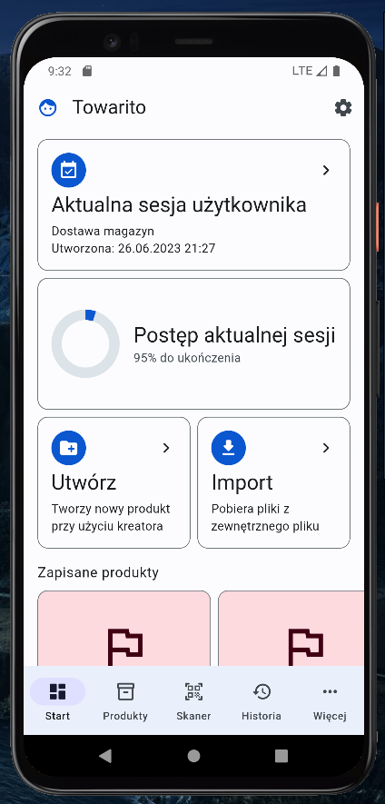
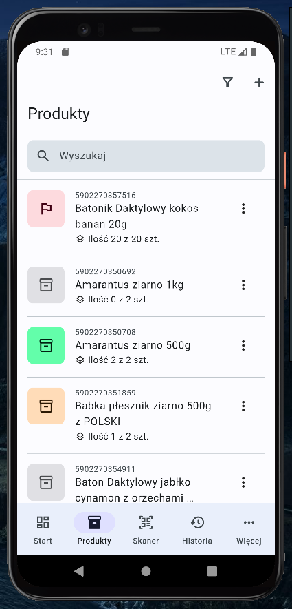
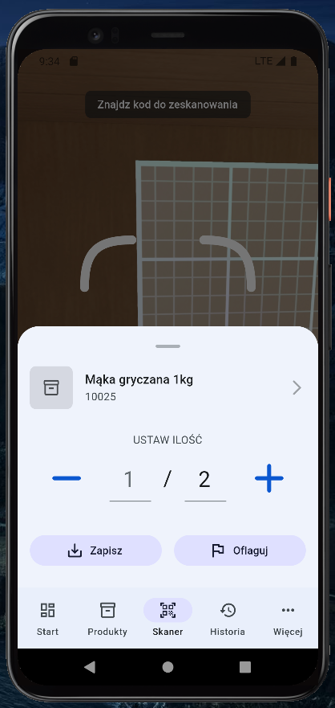
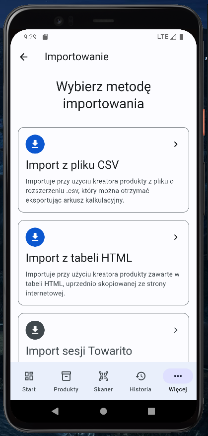

# Towarito

Towarito to aplikacja stworzona specjalnie dla przedsiębiorstw zajmujących się logistyką i magazynowaniem. Jest to narzędzie inwentaryzacyjne, które usprawnia proces przyjmowania dostawy towarów. Aplikacja umożliwia użytkownikom tworzenie sesji, w których mogą dodawać produkty i monitorować ich ilości. Aplikacja umożliwia importowanie danych produktów w celu skrócenia czasu koniecznego do wprowadzania informacji o towarze. Użytkownicy mogą łatwo zaimportować listę produktów z zewnętrznych plików, takich jak CSV lub TXT. Towarito wykorzystuje technologię skanowania kodów kreskowych, co przyspiesza wyszukiwanie produktów. Użytkownicy mogą skanować kody kreskowe przy pomocy aparatu w swoim urządzeniu mobilnym i odnaleźć produkty w bazie danych aplikacji. Apliakcja używa trochę zmodyfikowanej struktury ["Clean Architecture"](https://resocoder.com/2019/08/27/flutter-tdd-clean-architecture-course-1-explanation-project-structure/).

## Screenshots

|  |  |  |  |
|:---:|:---:|:---:|:---:|
|  |  |  |  |

## Tech Stack

 - **State Management** - [Flutter Bloc](https://pub.dev/packages/flutter_bloc)
 - **Zapisywanie danych lokalnie** - [Hive](https://pub.dev/packages/hive)
 - **Dependency injection** - [Get It](https://pub.dev/packages/get_it)
 - **Skaner kodów kreskowych** - [MobileScanner](https://pub.dev/packages/mobile_scanner)
 - Equatable, rxdart, dartz
 - Material Design 3
